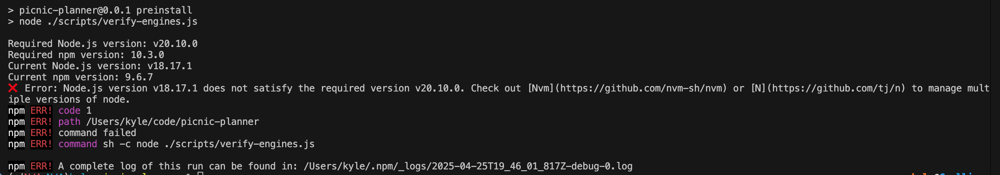

# Contributing to Picnic Planner

Hello! Thanks for deciding you want to contribute to Picnic Planner. Follow these steps to understand how to obtain the code for yourself, build it, iterate on it and then what you should expect the Pull Request + Review Process to go like. 

## Running Locally

To run this project as intended you'll need [Docker](https://www.docker.com/), go ahead and grab that.

First you'll need to fork this repo so that you can have a copy. You can do this within the Github UI. Then clone your fork locally. 

Next you'll need to install the NPM dependencies of the project. 
```
npm install
```

> NOTE: We use some pre-install logic to ensure you are on a version of node that we use for this project! If you don't already use [Nvm](https://github.com/nvm-sh/nvm) or [N](https://github.com/tj/n) to manage multiple versions of node you may want to download those so that you can be on the correct version of node. If the step above errored out, it's likely because you are on an incorrect version of node. 
> 
> We know it might seem like a PITA to move to a different version of node, but we do this to prevent later foot-guns and ensure our local development stack has as much [environment parity](https://12factor.net/dev-prod-parity) we can muster with our CI/CD and deployed environments.



After you've installed the dependencies you can use start the application by running this from the root of the project.

```
npm dev
```

This will spin up a docker-compose command. If you'd like you can add `-- -d` to run the command _detached_ so that it doesn't have output to the terminal. The frontend will run on localhost:3000 by default and send requests to the backend at localhost:3001


## Development workflow

You should make your changes and then commit and push them to your repository. Then you can issue a pull request where you request your code to be brought into the main of the upstream project. Note: We have workflows that must pass for your branch to even be considered, your best change of passing these is to ensure you're utilizing the pre-commit and pre-push hooks locally. 👍

You can always opt to run the code quality checks yourself either from the root of the project (which runs all children) or by changing directories into a given project and running it there. (Or checkout [Turborepo syntax for "Using a Task Identifier"](https://turborepo.com/docs/reference/run#using-a-task-identifier) 🤯)

The available quality checks are:

```
npm run build
npm run lint
npm run format:check
```

* If you fail an `npm run format:check` you can use `npm run format` to forcibly fix any files that can be auto-fixed
