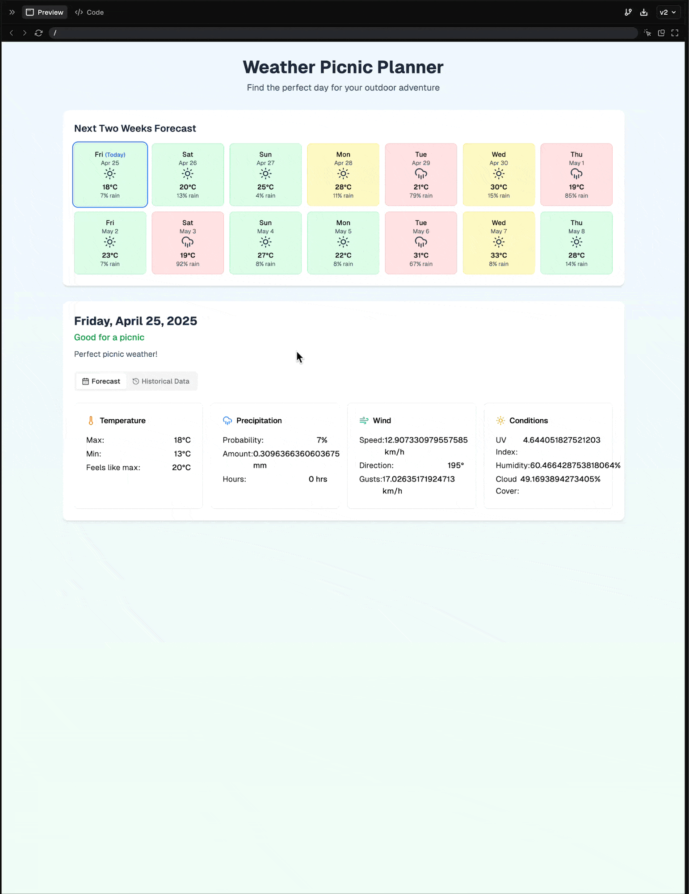

# I-Build: Picnic Planner App by Kyle Bennett

This document will follow a similar convention to an [i-search](https://gallaudet.edu/student-success/tutorial-center/english-center/citations-and-references/i-search-paper-format-guide/) paper. It is meant to take the form of a narrative where we explain a little about a topic, but then maintain a real-time blog style of writing that cronicles the journey of building a project. 

I was given a [spec README.md](./README.md) for a picnic planning app. It spells out some criteria but since it doesn't cover EVERYTHING I'm going to set some additional constraints for myself. 

## Self-Imposed Constraints

I'm going to impost the following constraints to make sure this coding task can be done in the 4hr time block.

1. No deployment, local builds/runs only. CI/CD gets pretty complex especially if we are getting into high availabilily, TLS certs and whatnot. So this full-stack app should just run locally. I will include some code-quality check on pre-commit that mimic CI/CD Code quality but again, just local for now. (In a real devops inner loopthose checks would be intended to run _pre-push_  but since I'm only pushing once to submit my PR, I'll use pre-commits for now.)
2. No Mobile. Since I'm writing this on a 13in Mac Book Pro I'm going to presume my reviewers are on similar Laptop/Desktop style and so I won't be messing around with CSS for mobile views, nor doing any extreme optimization for low bandwidth networks. We will still employ caching to minimize network requests (as part of the task requirements), but again we aren't considering the footprint of each of those requests.
3. Ideal, Fair Poor Criteria. This is entirely subjective to my own experience as a kid who grew up in the North East of the United States (Castkills of NY, Fredonia NY and Pittsburg PA). If I had additional time I'd love for the user to be able to set their own criteria, either directly setting parameters or by chatting with an LLM about their "ideal day" and letting the LLM set those parameters. Perhaps something like [Transformers.js](https://huggingface.co/docs/transformers.js/index) which I first heard about on [Syntax.fm](https://syntax.fm/show/740/local-ai-models-in-javascript-machine-learning-deep-dive-with-xenova) but that's more indepth than I have time for. For now I'm going to use chance of precipitation and temperature as my rough proxies for Ideal, fair and Poor. My design for this algorithm though will attempt to be open to extension ensuring alterations to the heuristics will be low cost later. 
4. Documentation. I'm going to use this file (i-build.md) to cronicle my building. I'll leave README.md intact (as it has my spec requirements). I will then use a single CONTRIBUTING.md to describe how someone might get this application running locally and expect to contribute to the codebase. I also set myself as default owner in the CODEOWNERS file to leverage Github review mechanics to automatically reviewer. If we had groups we might also add a group to that file (out of scope).
5. Caching. Will likely use Redis to cache forecast information by ZipCode. If not just store it in the databse. I'll likely have this expire after an hour. To help with visualizing on the frontend I think it would be nice to show when data has returned from a cache or a full request to the API but maybe I'll leave that out. 🤷‍♂️
6. Local Development. If this were intended to be deployed to a Kubernetes cluster I might advocate a development environment that most mimics production by using tools like [Minikube](https://minikube.sigs.k8s.io/docs/start/?arch=%2Fmacos%2Farm64%2Fstable%2Fbinary+download) or [k3s](https://k3s.io/) on [k3d](https://k3s.io/). However, I'm going to stick with one nodejs/express backend and a single react application that are composed together (with any other resources like redis) with Docker. Design of the express application will try to ensure that should we move to multiple microservices later, we can "lift-and-shift" entire groups of routers/controllers/services to our heart's content. Building separate services instead of a react-app-within-node-app-monolith will put us one partial step closer to a read deployed microservice architecture.


## Setting my local environment

### Overview

My preferred stack (based on comfort, not necessarily the right tool for this task) is Full-Stack Typescript (react and express) with a Postgres persistence layer and a redis cache. I'm going to scaffold all of this not as a monolith, but as monorepo utilizing [npm workspaces](https://docs.npmjs.com/cli/v7/using-npm/workspaces) and likely [turborepo](https://turborepo.com/). Turborepo builds on workspaces by allowing caching npm builds and also enabling some nice workflows when running scripts across multiple project. 

Each project should be able to run on it's own (they are afterall each their own NPM project) however the intendend development flow is to use [Docker](https://www.docker.com/) and the docker-compose so I will focus on that flow.

(paused here to go write the beginning of the [CONTRIBUTING.md](./CONTRIBUTING.md) document.)
(I've just finished the beginning of the contributing document which outlines the requirements and includes the `install` and `dev` commands. Now let's into building a bunch of scaffolding code.)

### Npm Workspaces and Turbo Repo

#### Set the workspaces
I'm going to set up 2 projects within the `apps` folder, a frontend and backend. 

`npm init -w apps/fr`
`npm init -w apps/be`

This gives me an empty project in those locations each with their own package.json file. I also need to create/update a `.gitignore` to exclude node_modules.

#### Scaffold basic apps in each workspace

I'll need a react app in the fe and an express app in the backend, both should use typescript. 

I opt for the [quickstart guide for vite](https://vite.dev/guide/) using the command `npm create vite@latest . -- --template react-ts` to scaffold a frontend.

[This blog](https://blog.logrocket.com/express-typescript-node/) provides a fairly good start for an express backend but I will want to include [drizzleORM](https://orm.drizzle.team/) so I won't follow this exactly as I scaffold my express project. But here's what I'll be happy to steal for the sake of speed:

- `npm install express dotenv npm install -D typescript ts-node @types/node @types/express nodemon eslint prettier` gets me some basic dependencies I'll need (both production and development). 
- `npx tsc --init` gets me a simple `tsconfig.json` I'll probably leave most of this. 
- I lifted the `prettier` and `eslint` configs from the blog post above. 
- I'm also happy enough with the scripts provided in the blog for `start` and `dev` so I shamelessly steal those for `apps/be/package.json`.

#### My mind is racing with what is left to do!

I'm going to take a sec here because we've now got a front and backend that can run. I haven't even gotten to the meat of the assignment yet, but that's because there's so much foundation that (in my view) _should be done before you get to the meat_. This boilerplat is going to take me a bit longer to get done and I might end up spending more than the 2-4hrs on the project prescribed (I've already spent about 1.5) but as this project is under open source I wnat to ensure this is something I'm proud to demo even after this interview. 

The best way to keep track of a project is with something like Trello or Jira, that's overblown for this project so I'm going to use [Todo.md](./TODO.md) at the root of this repo. It is a rankend queue of what I intend to get done in the next steps. Stuff that comes up might not necessarily end up at the top or bottom, it will get inserted where I think it's appropriate. 

#### TurboRepo

Now that I have a front and backend I want to ensure that any time I commit I am committing VALID CODE: never break main! Turborepo combined with pre-commit & pre-push hooks will help me with this. Many teams will run these types of checks on a pull request but we chose to do them at the developer level believing that [Shifting Left](https://en.wikipedia.org/wiki/Shift-left_testing) helps full stack developers actually be "full stack" rather than throwing their code over to the devops cycle. In my opinion shifting left helps developers understand what needs to happen before pushing code to production.

So in this commit I added [TurboRepo](https://turborepo.com/docs) which has one task, `build`. This means that at the root of the repo I can set an npm script `build` => `turbo run build` => `npm run build (in each of the apps!)`. This parallelization and some out-of-the-box-caching should stop any whiners who whine "The build steps take so long on each commit". We also can do some more advance caching in the future by declaring our inputs and outputs of the given task to leverage deterministic builds. If we get super mature we can even us [Remote Caching](https://turborepo.com/docs/crafting-your-repository/constructing-ci#enabling-remote-caching) so our team can share their build caches (out of scope for now).


### Pre-Install Script

In the CONTIBUTING.md we talk about how a `preinstall` script will verify the right version of node is installed. A quick AI query with a few of my own edits for error checkign gets me something I can live with in [scripts/verify-engines.js](scripts/verify-engines.js). Originally it used some 3rd party packages but since this runs before any sort of install and I want to keep installation simple I have used only core Node modules so that the script should _in theory_ be able to run with whatever system version of Node is installed (even one that's fairly old).

### Code Quality Checks

I have some gists [here](https://gist.github.com/BennEntterprise/b78f617dd3b7701ca08b8038deb0668b) and [here](https://gist.github.com/BennEntterprise/f332c9e2040c77e6eee023c8ba61144f) that I've used in the past to accomplish two goals:

1. Ensure minimial setup with an automated "migrate" script for hooks.
2. Ensure that git scripts (inside an untracked `.git` folder) have a way to verify they are the "latest" with what the team expects in the codebase.

Point 2 has some potential foot-guns where it might get a bit wonky if you are iterating on the scripts, but in general these things aren't chaning very often so most developer won't need to deal with this wonkiness. I'm not going to worry about that for now though since I'm the only one working on this. For now I've just I piped the migrate script into an agent and asked for an node translation (with some improvements for idempotency) to get [migrate-git-hooks.js](./scripts/migrate-git-hooks.js) since we know node is installed in the system (due to preinstall check above)

The pre-commit & pre-push scripts themselves just call `npm run build`, this ensures that both the client and server can build before checking in code. 

### Docker 

My tree looks like this: 
```
picnic-planner: %  tree -I'node_modules'
.
├── CODEOWNERS
├── CONTRIBUTING.md
├── LICENSE
├── README.md
├── TODO.md
├── apps
│   ├── be
│   └── fe
├── i-build.md
├── package-lock.json
├── package.json
├── scripts
│   ├── git
│   └── verify-engines.js
└── turbo.json
```

For the first time so far I'm allowing an agent (GTP-4o) access to my codebase rather than prompting then lifting what I like. It gave me something half working for Dockerfiles and Docker but I pulled [this blog post](https://medium.com/@tomas.ew88/recently-i-was-setting-up-docker-to-work-with-a-vite-project-and-also-an-express-server-ab65456e64d5) to actually get both up. I also had some weirdness going on with Docker where it wasn't seeing the `cors` of `@types/cors` modules. Needed to nuke docker and clear some caches but it took. 

### A frontend

I'm going to tackle the frontend first. I've used services like [Bolt from Stackblitz](https://bolt.new/) and [v0.dev from Vercel](https://v0.dev/) to scratch one-off musings I have around UIs, I'm not a designer and prefer to get to the backend logic quickly so I'm going to chose [v0.dev from Vercel](https://v0.dev/) for this iteration. I'm shamelessly going to pump a portion of the README into the agent, leaving off the Architecture requirements.

The sections I provided as context are: 
[Intro](./README.md#️-weather-picnic-planner)
[Main Features And Requirements > Interactive Two Week Forecast Calendar](./README.md#1-interactive-two-week-forecast-calendar)
[Main Features And Requirements > Detailed Weather View For Each Day](./README.md#2-detailed-weather-view-for-each-day)

I provide specific instructions NOT to attempt to implement the api.  Aside from few UI bugs (big float numbers) I'm fairly happy with what it came out with. 

If you want to inspect that conversation it's [here](https://v0.dev/chat/weather-picnic-planner-qf3uia6Ytoy).



v0 utilizes TailwindCSS to style components and so I will be able to copy & paste many of the components over to the frontend. These all rely on a mock-data.ts 

The work I DO need is to integrate [Shadcn](https://ui.shadcn.com/docs/installation/vite) so I've done that and then copied in the UI components I need into my `apps/fe` folder.

I also fixed some linting problems and then introduced a turbo task for `npm run lint` to run the linter in each project. 

### The backend

Slow is smooth and smooth is fast.

Phew, okay we got through a bunch of the stuff that some people might say is overblown but it's something I feel is important when you want to set good roots for an organization. I've worked in places where developer churn and fatigue was greatly attributed to a messy codebase without any sort of standards. 

- Diffs were large because re-formatting touched code that was irrelevant
- Differences in local environments cause "it works on my machine" headaches
- Different styles made the company feel immature.
W

We've fixed all of that an now it's time to get into some Architecture.

#### Patterns

I am going to use a few patterns. 

First I'll assume that the client is going to call my api with a unique key to determine which Weather Service we will utilize. We will use a [Strategy Pattern](https://sbcode.net/typescript/strategy/) to determine which class to instantiate and in the process will also return a [Factory](https://sbcode.net/typescript/factory/).

To begin with our factor will only know how to create a concrete class for [open-meteo](https://open-meteo.com/) (likely using the [openmeteo javascript/typescript library](https://www.npmjs.com/package/openmeteo)), but as time goes on we could allow this factory to create more concrete instances that all implement the same interface. 

Similarly the Strategy pattern will only invoke one instance of the factory, but it too is open for extension later.

But first, I want to set up _one final code quality_ check.


#### Testing

For the backend I'm a fan of [ts-jest](https://www.npmjs.com/package/ts-jest) it allows tests to be written in typescript and largely piggy backs off the `tsconfig.json`. For the frontend I used [vitest](https://vitest.dev/guide/) as it's already got a vite build system. For both apps I created a `utils` folder and put a sample test for a sum function.

I added Turbo task for `test` and hooked that up to `npm run test`. I added that to the pre-commit and pre-push scripts as well.

The final bit of testing we'd want to include is some sort of integration and/or end-to-end tests. I've personally found that everyone has their own interpretation of what constitutes "integration" but for me it largely means running unit tests WITHOUT mocks thereby testing the integration of multiple classes so in theory we can grow into that. For end-to-end testing I've dabbled with [Cypress.io](https://www.cypress.io/) but I won't be implementing that here. 
